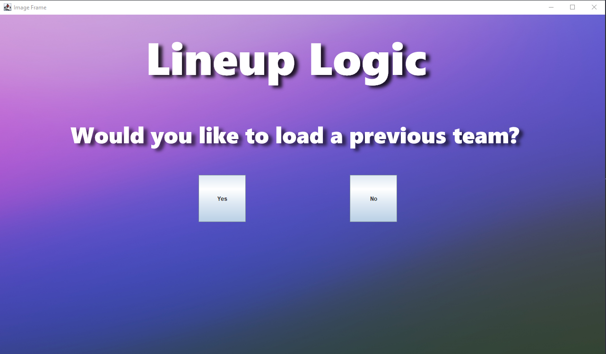
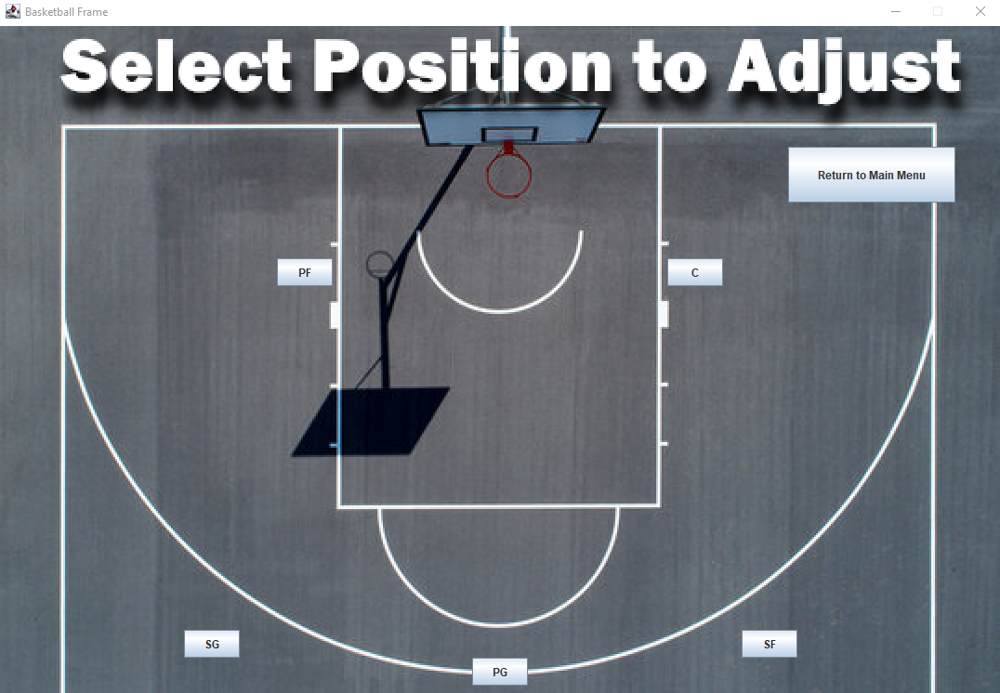

<h1>Lineup Logic </h1>
<h2>Created by Harper Kerstens</h2> 

This project to help a team owner/coach manage his players and lineup for a respected sport with expandability at the forefront of the design. Created for a project during my time in second year I drew from my passion in sports to 
attempt to create something to combine two fields I love. The project allows you to create a team roster for either Hockey or Basketball which can be saved and worked with at a later time. You can add or change pivotal information to a player as well as the team such as players jersey number, minutes and more on the player specific side and who is starting for the team on the team side. 

<h3>Start up screen</h3>

 On startup you're prompted to either load a previous team or create a new team picking from either Hockey or Basketball. You then must enter the number of players you have and it must be the minimum amount required to play or else it will prompt you again until given a valid number.

<h3>Main Menu</h3>

 From the main menu you are able to select from a multiple of options. Set the starting lineup with a visual aid, adjust players information, view players information, and save the current teams information. 

<h3>Selecting Starters</h3>

 From the startes the playing field of the respected sport is displayed with interactive buttions specific to a positon are available for the user to set starters. 

<h3>View Team and Adjust Player specific information</h3>

 The user is able to view the current roster and starters as well as adjust player specific information. 

